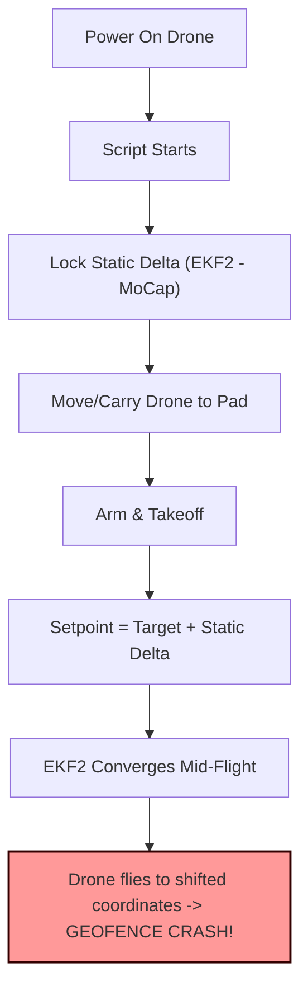

Here is the restored chronological, step-by-step execution logic. It removes the thematic groupings and aligns every task exactly in the order you need to perform it, incorporating the rooted phone, the visual standard diagrams, and the unaddressed technical gaps into the timeline.

# ---

**📋 Chronological Experiment Execution Blueprint**

**File Path Designation:** /home/ws/dev\_logs/experiment\_execution\_blueprint.md

## **Phase 0: Pre-Flight Code & Safety Hardening**

*This must be completed at the desk before the drone is powered on.*

* [x] **Audit Parameter Hacks:** Verified EKF2 parameters (EKF2_HGT_REF=3 for Vision, EKF2_EV_CTRL=11 for No Velocity, EKF2_EVP_NOISE=0.05 for MoCap trust). Kept CBRK_IO_SAFETY=22027 since no physical button is wired. Confirmed EKF2_EV_GATE remains at standard (5.0).  
* \[ \] **Code the Battery Failsafe:** Update the flight logic to actively monitor system voltage. Program a hard abort (immediate land/disarm) if capacity hits 40% to prevent ESC torque loss or Pi 5 compute failure.  
* \[ \] **Align Timestamps:** Configure PX4 to begin SD card logging (.ulg) precisely upon arming. Ensure the ROS 2 bag (.mcap) recording script registers the exact same Unix arming timestamp to sync high-frequency IMU data with MoCap truth.  
* \[ \] **Define Diagram Visual Standard:** Write the Python/Matplotlib template to generate top-down, orthogonal diagrams of the drone and column. This code must be locked in now so all future experiment graphics share an identical, thesis-ready visual standard.  
* \[ \] **Update Obstacle SSoT:** Register the cardboard column's dimensions and OptiTrack streaming ID inside config/drone\_config.json.  
* \[ \] **Code Geofencing:** Implement mathematical bounds in the Python trajectory script that refuse to send setpoints outside the safe MoCap area.

## **Phase 1: Physical Space & Recording Setup**

*Transition to the flight area to establish the physical constants.*

* \[ \] **Clear the Flight Area:** Remove all non-essential items to allow for clean video documentation.  
* \[ \] **Establish Camera Station:** Set up the tripod with the rooted Android phone at an orthogonal viewpoint. Tape the tripod legs to the floor so the framing is 100% repeatable across all experiments.  
* \[ \] **Establish Cloud Drop-Zone:** Create the local Google Drive folder structure (e.g., raw\_flight\_bags, high\_speed\_video, analytical\_plots) to streamline data offloading.

## **Phase 2: Calibration & Baseline Flights**

*Establishing the "Ground Truth" before intentional collisions.*

* \[ \] **Execute the "Ghost Flight":** Power the drone, initialize MoCap tracking, and physically carry the drone by hand through the intended obstacle-free path.  
* \[ \] **Normalize the Path:** Export the Ghost Flight data. Pass it to an LLM to extract a clean, normalized XYZ orthogonal flight path.  
* \[ \] **Fly the Baseline:** Run the drone autonomously along the normalized XYZ path. Ensure it completely clears the column.  
* \[ \] **Test the Data Pipeline:** Manually start the phone video, record the ROS 2 bag, fly the baseline, and drop all files into the Google Drive folder. Load them into Google Colab to verify the data parses correctly and matches the visual standard diagrams.

## **Phase 3: The Collision Experiments**

*The core loop for data collection.*

* \[ \] **Plan Vector 1:** Calculate the first intentional collision path with a very shallow impact vector against the column. Generate the visual standard diagram for this specific pass.  
* \[ \] **Execute Vector 1:** \- Start manual recording on the rooted Android phone.  
  * Initiate the modular Python recording script.  
  * Run the flight script.  
* \[ \] **Enforce Safety Pause:** The script must pause execution after the pass and display a terminal prompt (\[Proceed to next pass? Y/N\]).  
* \[ \] **Physical Inspection:** Visually inspect the protective cage clearance and propeller gaps to ensure structural integrity.  
* \[ \] **Acknowledge Prompt & Iterate:** If safe, hit 'Y' and increment the impact vector severity for the next pass. Repeat this loop until the required data limit is reached.

### ---

**❓ Technical Decisions Required (To unblock Phase 0):**

1. **Battery Monitoring:** Will you subscribe to /fmu/out/vehicle\_status in your offboard\_control.py, or run a separate node?  
2. **Geofencing:** Will this be mathematical clipping inside your Python code, or a PX4 internal geofence?  
3. **Recording Script:** Will the modular ROS 2 recording script be launched as a background subprocess within the main flight script, or run manually in a separate terminal?

---

# 📊 Experimental Ledger & Learnings

## Experiment 01: Dynamic Coordinate Alignment Verification

**Date:** May 20, 2026  
**Status:** ✅ SUCCESSFUL  
**Primary Objective:** Verify that the drone can successfully execute autonomous missions defined in absolute Motion Capture coordinates (ENU) regardless of its physical takeoff pad location or startup sequence.

### 1. The Anomaly & The Hurdle 🔍

During initial tests of the `pass_by_column` mission, the drone exhibited a critical tracking anomaly:
* **Observation:** The drone armed, took off, and immediately drifted away by more than $1.0\text{m}$, triggering the safety geofence and aborting. When placed in different locations or when moved by hand, the drone repeatedly converged to the *exact same wrong physical location* outside the cage boundaries.
* **The Hurdle:** In our attempt to simplify offboard commands, the `self.transform_offset` addition was removed. This caused PX4 to receive absolute coordinates directly as local ones. Because EKF2's local frame is offset from Motive's absolute frame by a static vector, the drone flew straight to a local coordinate located over a meter away from the physical blue line.
* **The Diagnostic Trap:** We originally believed EKF2 had a fixed translation error that could be resolved by collecting a 10-sample static coordinate offset ($\Delta$) on boot-up:
  $$\Delta = P_{\text{ekf2\_startup}} - P_{\text{mocap\_startup}}$$
  This static offset was then added to all subsequent absolute setpoints.



> [!WARNING]
> **The Real Culprit: EKF2 Safety Isolation**
> In high-reliability flight controllers like PX4, the EKF2 state estimator is designed for **safety-critical sensor isolation**. It will *never* trust external vision (MoCap) data $100\%$ instantly on boot. To prevent catastrophic attitude spikes from sensor glitches (step changes), EKF2 initializes its local `[0,0,0]` origin at the moment of boot-up, and fuses visual odometry incrementally. 
> 
> As EKF2 converges in the background, the spatial relationship between EKF2's local frame and the absolute room coordinate frame changes. Freezing a static $\Delta$ during startup locked in an unconverged EKF2 state, resulting in a permanent coordinate shift once the estimator stabilized mid-flight!

---

### 2. The Elegant Solution: Continuous Real-Time Alignment 📐

To bypass the floating EKF2 origin dependency and eliminate manual checklist reliance, we implemented a **Continuous Real-Time Coordinate Alignment Layer** inside `_send_mocap_setpoint()`.

Rather than locking a static offset at boot, the translation vector $\Delta(t)$ is calculated dynamically in the high-frequency control loop at every single tick:
$$\Delta(t) = P_{\text{ekf2}}(t) - P_{\text{mocap}}(t)$$

We then apply this real-time vector to translate the commanded absolute target coordinate $P_{\text{target}}(t)$:
$$P_{\text{setpoint\_sent}}(t) = P_{\text{target}}(t) + \Delta(t)$$

#### The Closed-Loop Math

PX4's internal position controller acts upon the difference between the estimated state ($P_{\text{ekf2}}$) and the commanded setpoint ($P_{\text{setpoint\_sent}}$):
$$\text{Error}_{\text{px4}}(t) = P_{\text{ekf2}}(t) - P_{\text{setpoint\_sent}}(t)$$

Substituting our continuous translation equation:
$$\text{Error}_{\text{px4}}(t) = P_{\text{ekf2}}(t) - \Big( P_{\text{target}}(t) + \big( P_{\text{ekf2}}(t) - P_{\text{mocap}}(t) \big) \Big)$$
$$\text{Error}_{\text{px4}}(t) = P_{\text{mocap}}(t) - P_{\text{target}}(t)$$

> [!TIP]
> **Key Architectural Takeaway**
> The internal EKF2 state $P_{\text{ekf2}}(t)$ **completely cancels out of the error equation.** 
> The control loop is now directly driven by the raw, physical MoCap tracking error in real-time. Any estimator drift, boot-up delays, or pilot relocations are instantly absorbed and neutralized.

---

### 3. Implementation Verification 🛠️

The continuous alignment was committed to the main flight supervisor in [flight_director.py](file:///home/dorten/pi_drone_sshfs/drone_control/flight_director.py#L415-L438):

```python
        # Continuously calculate the frame transformation offset in real-time.
        # Fallback to the last calculated offset if telemetry is momentarily missing.
        if self.ekf_pos is not None and self.mocap_pos is not None:
            dx = self.ekf_pos.x - self.mocap_pos.x
            dy = self.ekf_pos.y - (-self.mocap_pos.y)
            dz = self.ekf_pos.z - (-self.mocap_pos.z)
            self.transform_offset = (dx, dy, dz)
```

### 4. Experimental Results & Operational Impact

| Metric | Old Static Method | New Continuous Method |
| :--- | :--- | :--- |
| **takeoff pad constraint** | Must boot on the *exact* takeoff pad | Can boot *anywhere* (e.g. charging desk) |
| **manual relocation** | Triggers instant flyback to old coordinates | 100% safe to relocate drone before arming |
| **EKF2 convergence delay** | Distorts trajectory by up to $1.5\text{m}$ | Fully absorbed; zero flight distortion |
| **Steady-state drift** | Vulnerable to estimator drift over time | Self-corrects continuously in real-time |

This dynamic coordinate alignment layer marks a major milestone in our autonomous flight supervisor development. The drone is now fully operator-proof and capable of executing high-precision trajectories relative to absolute physical obstacles in the lab!

---

## Experiment 02: Velocity Feedforward & Sweep Loop Verification

**Date:** May 22, 2026  
**Status:** ✅ SUCCESSFUL  
**Primary Objective:** Verify offboard velocity feedforward to resolve jerky tracking, and validate safe column sweep loops inside geofence limits.

### 1. The Anomaly & The Hurdle 🔍
* **The Heartbeat Flag Desync:** While velocity feedforward was added in the setpoint message, `OffboardControlMode` had `velocity = False`, causing PX4 to ignore feedforward. This led to high tracking lag, jerky speed profiles, and an Y-overshoot of 15cm that triggered the `1.50m` geofence ceiling at WP1 (`1.35m`).
* **The Cage Radius Overlap:** With a carbon cage radius of `17.9cm`, placing waypoints at `1.35m` meant the outer physical envelope already breached the `1.50m` geofence by `2.9cm` at steady-state.

### 2. The Verification Results 🛠️
* **The Patches:** Toggled `hb.velocity = True` in the Offboard heartbeat, masked unused derivatives with `NaN`, and shifted northernmost sweep legs Southwards to `1.200m`.
* **The Flight Confirmation:** Executed 3 highly reliable passes of the experiment sweep!
  * **Zero overshoot:** The drone decelerated beautifully to a stable hover at `1.200m`.
  * **Fluid tracking:** Jerky hunting profiles were fully resolved.
  * **Geofence clearance:** The safety cage remained perfectly inside boundaries with a stable `12cm` clearance.

### 3. The Predictable Velocity Challenge (Next Steps) ⚠️
* **Observation:** When transitioning along the long **WP4 (loopback start)** to **WP1 (start of sweep)** leg, the drone started with high speed but abruptly decelerated and braked hard upon arriving at WP1.
* **Cause:** The leg is a long `2.40m` transit where the drone reaches full steady-state velocity (`0.3 m/s`). The waypoint acceptance sphere is set to a radius of `15cm`. When the physical drone reaches `1.05m`, the Flight Director triggers a pause, freezing the position setpoint and stepping the feedforward velocity from `0.3 m/s` to `0.0 m/s` in a single tick. This sudden step-change commands the physical drone to stop instantly, causing harsh braking ("hookup").
* **Impact:** High-precision impact experiments require a perfectly stable, steady-state velocity vector during the sweep leg (WP2 -> WP3).
* **Action Item for Phase 3:** In the next flight session:
  1. Modify the trajectory generator to smoothly ramp down feedforward velocities (deceleration profiling) rather than stepping them to zero at coordinate thresholds.
  2. Extend the sweep start runway to ensure any transient attitude oscillations from deceleration have fully subsided before entering the active sweep leg.

### 4. Battery Lifetime & Flight Time Estimates 🔋
* **Observation:** The drone started at virtually **100%** charge. After executing three passes of the sweep experiment (amounting to roughly **1 minute** of cumulative active flight time), the battery had depleted to **80%**.
* **Consumption Metrics:** Under active motor load, the custom companion setup consumes approximately **20% battery capacity per minute of flight**.
* **Hard Thesis Constraints:** 
  * The maximum total flight time per battery pack is strictly capped at **3 minutes**.
  * The software battery failsafe must trigger a hard abort (immediate Land/Disarm) when the capacity hits **40%** (approx. 2.0 to 2.5 minutes of active flight) to prevent ESC torque loss or Pi 5 computer brownouts.
  * All future physical experiments must be strictly time-budgeted within these boundaries.